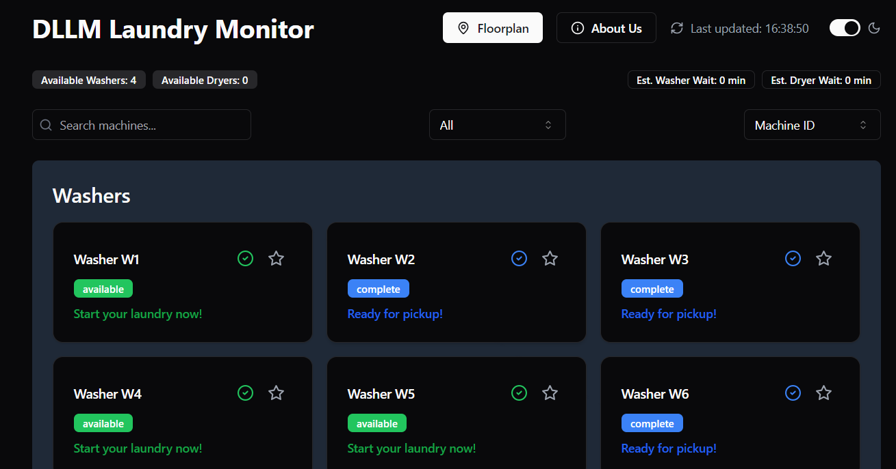

# DLLM Laundry Monitor 🧺

A smart IoT-based laundry management system providing real-time updates and monitoring with push notification support.



## Features

- 📱 **Real-time Monitoring**: Track the status of all washers and dryers
- 🔔 **Push Notifications**: Get notified when your laundry is ready
- 🗺️ **Interactive Floorplan**: Visual layout of the laundry room
- 🌓 **Dark Mode**: Easy on the eyes, day or night
- ⭐ **Favorite Machines**: Mark and track your preferred machines
- 🔍 **Search & Filter**: Quickly find available machines
- 📊 **Real-time Updates**: Automatic status refreshes every 30 seconds
- 💾 **Offline Support**: Service Worker caching for better performance

## Quick Start

### Prerequisites

- Node.js (v14 or higher)
- npm or bun package manager
- Modern browser with push notification support

### Installation

1. Clone the repository:
```bash
git clone <repository-url>
cd dllm-app
```

2. Install dependencies:
```bash
npm install
# or
bun install
```

3. Set up push notifications (see [Push Notifications Setup](#push-notifications-setup)):
```bash
npm run generate-vapid
```

4. Configure environment variables:
```bash
# Copy the template
cp config/env.template .env

# Edit .env and add your values
# The generate-vapid script will populate VAPID keys automatically
```

5. Start the development server:
```bash
npm run dev
```

6. Open your browser to `http://localhost:5173`

## Push Notifications Setup

### Quick Setup

1. **Generate VAPID Keys**:
```bash
npm run generate-vapid
```

This will automatically:
- Generate cryptographic VAPID keys
- Create/update your `.env` file
- Display the keys in the console

2. **Update Configuration**:

Open `.env` and update:
```env
VAPID_SUBJECT=mailto:your-email@example.com
VITE_REACT_APP_LAMBDA_URL=your-lambda-url
```

3. **Restart Development Server**:
```bash
npm run dev
```

4. **Enable Notifications**:
- Click the bell icon (🔔) in the app
- Grant notification permission when prompted
- The bell will turn green when subscribed

### Detailed Documentation

For comprehensive setup instructions, troubleshooting, and testing:
- [Push Notifications Setup Guide](docs/push-notifications-setup.md)
- [Push Notifications Testing Guide](docs/push-notifications-testing.md)

## Environment Variables

Required environment variables (create a `.env` file):

```env
# VAPID Keys (generate with 'npm run generate-vapid')
VITE_VAPID_PUBLIC_KEY=your-public-key
VAPID_PRIVATE_KEY=your-private-key
VAPID_SUBJECT=mailto:your-email@example.com

# API Configuration
VITE_REACT_APP_LAMBDA_URL=your-lambda-api-url
```

**Important**: Never commit your `.env` file to version control!

## Available Scripts

| Script | Description |
|--------|-------------|
| `npm run dev` | Start development server |
| `npm run build` | Build for production |
| `npm run preview` | Preview production build |
| `npm run lint` | Run ESLint |
| `npm run lint:fix` | Fix ESLint errors |
| `npm run format` | Format code with Prettier |
| `npm run format:check` | Check code formatting |
| `npm run check` | Run linter and format check |
| `npm run generate-vapid` | Generate VAPID keys for push notifications |

## Tech Stack

### Frontend
- **React 18** - UI library
- **TypeScript** - Type safety
- **Vite** - Build tool and dev server
- **Tailwind CSS** - Utility-first CSS framework
- **Framer Motion** - Animation library
- **Radix UI** - Accessible component primitives

### Push Notifications
- **Web Push API** - Browser push notifications
- **Service Workers** - Background sync and caching
- **VAPID** - Voluntary Application Server Identification

### Routing & State
- **React Router** - Client-side routing
- **Context API** - State management (Dark Mode)
- **Custom Hooks** - Reusable logic

### UI Components
- shadcn/ui component library
- Lucide React icons
- Custom machine cards and floorplan

## Project Structure

```
dllm-app/
├── api/                      # API endpoints (subscribe/unsubscribe)
├── config/                   # Configuration templates
├── docs/                     # Documentation
│   ├── push-notifications-setup.md
│   └── push-notifications-testing.md
├── public/                   # Static assets
│   ├── service-worker.js    # Service Worker for push notifications
│   ├── manifest.json        # PWA manifest
│   └── icons/               # App icons
├── scripts/                  # Utility scripts
│   └── generate-vapid-keys.js
├── src/
│   ├── components/          # React components
│   │   ├── laundry/        # Laundry-specific components
│   │   ├── layout/         # Layout components
│   │   ├── pages/          # Page components
│   │   └── ui/             # Reusable UI components
│   ├── contexts/           # React contexts
│   ├── hooks/              # Custom hooks
│   │   ├── usePushNotifications.ts
│   │   ├── useMachineSetup.ts
│   │   └── use-toast.ts
│   ├── types/              # TypeScript types
│   ├── lib/                # Utilities
│   ├── App.tsx             # Main app component
│   └── main.tsx            # Entry point
├── .env                     # Environment variables (create this)
├── package.json
└── README.md
```

## Browser Support

### Desktop
- Chrome 42+
- Firefox 44+
- Edge 17+
- Safari 16+

### Mobile
- Chrome (Android)
- Firefox (Android)
- Safari (iOS 16.4+)
- Samsung Internet

## Features in Detail

### Real-time Monitoring
- Fetches machine status from Lambda API
- Auto-refreshes every 30 seconds
- Shows machine status with color coding:
  - 🟢 Green: Available
  - 🟡 Yellow: In Use
  - 🟠 Orange: Finishing Soon
  - 🔵 Blue: Complete
  - ⚫ Gray: Disabled

### Push Notifications
- Browser-based push notifications
- Subscribable with one click
- Persistent across sessions
- Works even when app is closed
- Service Worker handles notifications in background

### Interactive Floorplan
- Visual representation of laundry room
- Click machines to see details
- Real-time status updates
- Responsive design

### Dark Mode
- Automatic system preference detection
- Manual toggle
- Persists across sessions
- Smooth transitions

### Preferred Machines
- Mark frequently used machines as favorites
- Quick access to preferred machines
- Saved in local storage

## Development

### ESLint Configuration

For production applications, enable type-aware lint rules:

```js
export default tseslint.config({
  languageOptions: {
    parserOptions: {
      project: ["./tsconfig.node.json", "./tsconfig.app.json"],
      tsconfigRootDir: import.meta.dirname,
    },
  },
});
```

### Code Style

- Use Prettier for formatting
- Run `npm run format` before committing
- ESLint enforces code quality
- TypeScript for type safety

## Deployment

### Prerequisites
- HTTPS (required for push notifications)
- Environment variables configured
- Valid VAPID keys

### Build for Production

```bash
npm run build
```

The build output will be in the `dist/` directory.

### Deploy to Vercel

```bash
# Install Vercel CLI
npm i -g vercel

# Deploy
vercel

# Set environment variables
vercel env add VITE_VAPID_PUBLIC_KEY
vercel env add VAPID_PRIVATE_KEY
vercel env add VAPID_SUBJECT
```

### Deploy to Netlify

```bash
# Install Netlify CLI
npm i -g netlify-cli

# Deploy
netlify deploy --prod

# Set environment variables in Netlify UI
```

See [Push Notifications Setup Guide](docs/push-notifications-setup.md#production-deployment) for detailed deployment instructions.

## Testing

### Manual Testing

1. Test in different browsers
2. Test push notification subscription
3. Test machine status updates
4. Test dark mode toggle
5. Test floorplan interaction

### Push Notification Testing

See [Push Notifications Testing Guide](docs/push-notifications-testing.md) for detailed testing instructions.

Quick test:
```javascript
// In browser console
navigator.serviceWorker.ready.then((registration) => {
  registration.showNotification('Test', {
    body: 'This is a test notification!',
    icon: '/icons/android-chrome-192x192.png'
  });
});
```

## Troubleshooting

### Push Notifications Not Working

1. Check browser supports push notifications
2. Verify HTTPS (required in production)
3. Ensure VAPID keys are configured
4. Check Service Worker is registered
5. Verify notification permission is granted

See [Troubleshooting Guide](docs/push-notifications-setup.md#troubleshooting) for more help.

### Common Issues

**Issue**: "VAPID public key is not configured"
- **Solution**: Run `npm run generate-vapid` and restart dev server

**Issue**: Service Worker not registering
- **Solution**: Check browser console for errors, clear cache

**Issue**: Notifications not appearing
- **Solution**: Check browser notification permissions, verify subscription status

## Contributing

1. Fork the repository
2. Create a feature branch
3. Make your changes
4. Run linting and formatting
5. Submit a pull request

## License

[Your License Here]

## Support

For issues and questions:
- Check the [documentation](docs/)
- Review [troubleshooting guide](docs/push-notifications-setup.md#troubleshooting)
- Open an issue on GitHub

---

Built with ❤️ using React, TypeScript, and Vite
